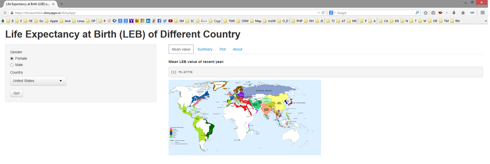

## Introduction and Motivation
**Life Expectancy at Birth (LEB)** is the expected (in the statistical sense) number of years of life remaining at birth. There are great variations in life expectancy between different parts of the world, mostly caused by differences in 

> * Economic circumstances
> * Public health
> * Medical care 
> * Industrial pollution

The impact of AIDS is particularly notable on life expectancy in many African countries. The difference in life expectancy between men and women is also obvious. Therefore, we build this **Shiny App** to show the LEB of different country and gender.

---

## Shiny App: LEB of Different Country

<div style='text-align: center;'>
    
</div> 
[LEB of Different Country App Hosted by shinyapps.io](http://thurawinhein.shinyapps.io/ShinyApp) 

---

## Features

Enter the gender and country you intrested in and get informed!

```{r echo=FALSE,results='asis',message=FALSE}
require(rCharts)
LEBmaleCat <- read.csv("./assets/data/Male.csv")
LEBfemaleCat <- read.csv("./assets/data/Female.csv")
LEBmaleCat$Year<-as.numeric(format(
    as.Date(as.character(LEBmaleCat$Date),format="%d/%m/%Y"),"%Y"))
LEBfemaleCat$Year<-as.numeric(format(
    as.Date(as.character(LEBfemaleCat$Date),format="%d/%m/%Y"),"%Y"))
LEBmaleCat$gender<- factor("male")
LEBfemaleCat$gender<- factor("female")

temp1<-subset(LEBmaleCat,LEBmaleCat$country=="United States",
              select=c("Year","Value","gender"))
temp2<-subset(LEBfemaleCat,LEBfemaleCat$country=="United States",
                  select=c("Year","Value","gender"))
temp<- rbind(temp1,temp2)
# temp<-temp[order(c(temp$Year,temp$gender)),]
names(temp)<-c("Year","Life Expectancy at Birth Value","gender")

hp1 <- hPlot(x = "Year", y = "Life Expectancy at Birth Value",
             group="gender", data = temp, type = "line")
hp1$print('chart1')
```

*Plot: LEB trend by gender in USA* 
[Github Repository](https://github.com/thurawinhein/Course_Project-Developing_Data_Products)

---

## Conclusion

- Writing the application + these slides took me around 3 hours.
  That's pretty excellent for making such a huge work available (displayable,
  testable) by third parties.  A wonder, in fact.

- With these R technologies, I really feel I stand on the shoulders of giants.


